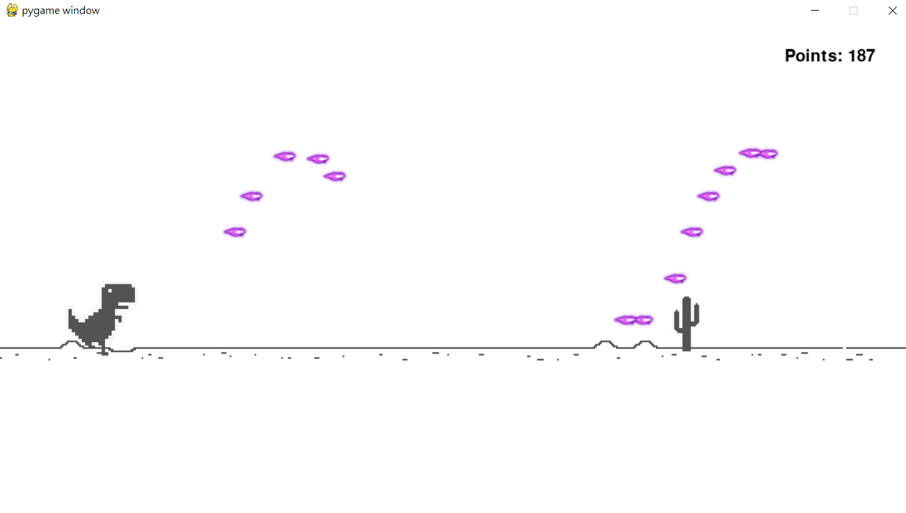

# Some Info of this project

This is Python class's Final Rroject.

## There are two version in this project

* battle game version (haven't done)
  * Chrome dino and the bird battle.
  * Old idea, but it is a little bit difficult. I don't have enough time to done it.
* run and shoot version
  * Chrome dino running and shoot the bird

## run and shoot version
>
> **Info** : This project can play but not perfect.

You can use keyboard's W,S,and J to contorl Dino

## battle game version

### There are two parts of battle game version

Part 1 : server

* Use flask to open APIs

Part 2 : client

* same code for two player

## Current progress

### Done

* Two player's connection via local area network by using zero tier one
* One of the player's action show in another player's window

### Developing

* Character's sprite
* Gaming page
